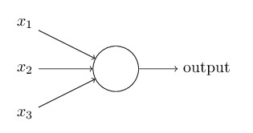

# Redes neuronales

## Neurona artificial

### Perceptrón

https://towardsdatascience.com/perceptron-and-its-implementation-in-python-f87d6c7aa428

Definido por Frank Rosenblatt en 1957, el perceptrón es una neurona artificial (una unidad de red neuronal) que realiza ciertos cálculos para detectar capacidades de los datos de entrada. Desde el punto de vista matemático se trata de un algoritmo de aprendizaje de clasificación binaria supervisado.

Al principio, el perceptrón fue planteado por Rosenblatt como una máquina y no tanto como un programa. Fue más adelante cuando su concepto se transformó al ámbito del software.

Desde el punto de vista biológico (inicialmente se pretendía emular con máquinas el modo de funcionar del cerebro humano), el Perceptrón sería equivalente a la neurona. Así como la neurona es en biología la unidad básica del cerebro, el perceptrón es el modelo matemático más simple de una red neuronal.

De hecho, al perceptrón se lo conoce como la red neuronal mínima, con una capa de entrada y otra de salida. Y en ocasiones se puede utilizar para modelos de clasificación, codificación de bases de datos, o monitorización de datos de acceso.

Un perceptrón recibe varios inputs binarios y produce un único output binario.

El perceptrón es un modelo matemático de una neurona. Una neurona recibe varias entradas, realiza algunos cálculos y produce una salida. En el modelo más simple de una neurona, cada entrada puede ser considerada como un número real. La neurona calcula la suma ponderada de sus entradas (multiplicando cada entrada por un peso) y produce una salida si la suma es mayor que un valor umbral.

donde cada input x~1~, x_2, x_3, ... es multiplicado por un peso w_1, w_2, w_3, ... y la salida es igual a la suma de estas entradas ponderadas por su peso.

en el caso de la imagen, podríamos tener algo como esto:

$$
output = x_1 w_1 + x_2 w_2 + x_3 w_3 
$$

que generalizado para un número indeterminado de entradas sería:

$$
output=\left \{
    \begin{array} {lll}
    0 & if &\sum_{j} w_j x_j \geq threshold
    \\
    1 & if &\sum_{j} w_j x_j \leq threshold
    \end{array}
\right.
$$

### Sigmoid neuron

Aunque el perceptrón tiene gran relevancia para entender el concepto de neurona artificial, hoy en día no es un modelo muy utilizado. En redes neuronales modernas el modelo principal es del de la 

## Redes neuronales (*Artificial Neural Networks* o ANNs)

Artificial neural networks (ANNs, also shortened to neural networks (NNs) or neural nets) are a branch of machine learning models that are built using principles of neuronal organization discovered by connectionism in the biological neural networks constituting animal brains.

An ANN is based on a collection of connected units or nodes called artificial neurons, which loosely model the neurons in a biological brain. Each connection, like the synapses in a biological brain, can transmit a signal to other neurons. An artificial neuron receives signals then processes them and can signal neurons connected to it. The "signal" at a connection is a real number, and the output of each neuron is computed by some non-linear function of the sum of its inputs. The connections are called edges. Neurons and edges typically have a weight that adjusts as learning proceeds. The weight increases or decreases the strength of the signal at a connection. Neurons may have a threshold such that a signal is sent only if the aggregate signal crosses that threshold.

Typically, neurons are aggregated into layers. Different layers may perform different transformations on their inputs. Signals travel from the first layer (the input layer), to the last layer (the output layer), possibly after traversing the layers multiple times.

### Topologías de redes neuronales

## Deep Learning (aprendizaje profundo)

Nos podemos encontrar varias capas intermedias con varias neuronas cada una, llegando a lo que llaman "redes neuronales profundas". La idea es que con más capas con más neuronas cada una se pueden mejorar las predicciones en conjuntos de datos más complicados.

## Redes convolucionales

## Fuentes

http://neuralnetworksanddeeplearning.com/
